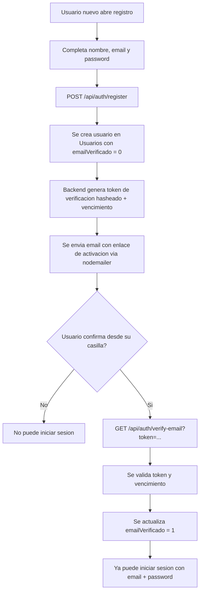

# Guia Integral del TPF: Auth, JWT, Sesiones, Roles y Pruebas

Fecha: 2026-07-05
Nivel objetivo: estudiante (explicacion tecnica y practica)

## 0) Como usar esta guia

Esta guia esta pensada para que puedas:

- entender que hace cada capa del backend,
- comprender como funciona JWT y por que se usa,
- dominar el flujo de register/login/verify/forgot/reset,
- practicar pruebas de forma ordenada (Postman y web),
- preparar una demo clara para docentes.

Recomendacion de estudio:

1. Leer secciones 1 a 6 sin ejecutar nada.
2. Hacer secciones 7 y 8 con Postman.
3. Repetir seccion 9 (web) para afianzar.
4. Usar seccion 11 para troubleshooting.

## 1) Definicion funcional del sistema

Dominio: espacios colaborativos de enlaces.

- Un espacio representa un contexto (equipo, afinidad, tema).
- Cada espacio tiene un owner.
- Otros usuarios pueden solicitar ingreso.

Roles funcionales:

- Owner:
  - crea espacios,
  - aprueba/rechaza/expulsa miembros,
  - crea/modifica/borra links del espacio,
  - revisa miembros y logs.
- Visitante aprobado:
  - crea links,
  - lista y busca links en espacios autorizados.
- Usuario pendiente o no autorizado:
  - solo puede solicitar ingreso,
  - no puede operar links en espacios no autorizados.

Regla central del negocio:

- un mismo usuario puede ser owner en un espacio y visitante en otro.

## 2) Arquitectura aplicada (capas)

Patron aplicado:

- routes: define endpoints y middlewares.
- controllers: traduce request/response HTTP.
- services: reglas de negocio y decisiones de autorizacion.
- repositories: queries y acceso a BD.
- middleware: JWT, validacion y seguridad transversal.

### 2.1 Flujo de una request protegida

1. El cliente envia request con header Authorization Bearer token.
2. El middleware JWT valida firma y expiracion.
3. Si es valido, inyecta request.user.
4. El controller recibe request.user y deriva a service.
5. El service aplica reglas de negocio y permisos.
6. El repository ejecuta SQL.
7. El controller responde usando helper de respuesta uniforme.

### 2.2 Por que esta separacion es importante

- Mantenibilidad: cambios de negocio no rompen rutas.
- Testeabilidad: service se prueba sin HTTP.
- Seguridad: permisos quedan centralizados en service.
- Escalabilidad: repository facilita cambios de motor o queries.

### 2.3 Guia general end-to-end (como funciona todo)

Secuencia completa de funcionamiento de la aplicacion:

1. Inicio de app:

- Express levanta configuraciones (dotenv, CORS, JSON parser, swagger).
- Se inicializa conexion a MySQL.
- Se montan rutas publicas y protegidas.

2. Alta de usuario:

- `POST /api/auth/register` valida payload.
- Se guarda usuario con `passwordHash` (bcrypt) y `emailVerificado=0`.
- Se genera token de verificacion, se guarda su hash y se envia email con enlace.

3. Verificacion de email:

- `GET /api/auth/verify-email?token=...` valida hash + expiracion.
- Si es correcto, se marca `emailVerificado=1` y se invalida token.

4. Login y sesion:

- `POST /api/auth/login` valida credenciales y estado de verificacion.
- Si es exitoso, responde `accessToken` JWT con vencimiento corto.

5. Requests protegidas:

- El cliente envia `Authorization: Bearer <token>`.
- Middleware JWT valida firma/expiracion y completa `request.user`.
- Controller delega en service y service aplica autorizacion por rol/contexto.

6. Persistencia de negocio:

- Repositories ejecutan SQL sobre `Usuarios`, `Espacios`, `Espacio_Usuarios`, `links`.
- El modelo garantiza que permisos se definan por `idEspacio` y estado de membresia.

7. Recuperacion de contrasena:

- `forgot-password` genera token temporal (se guarda hash) y envia enlace por mail.
- `reset-password` valida token + expiracion, actualiza hash bcrypt e invalida token.

8. UX y seguridad de salida:

- La UI no expone tokens ni links internos.
- El endpoint de verificacion responde HTML amigable para navegador y JSON para API (`?format=json`).

## 3) Autenticacion y sesiones con JWT

Modelo de sesion implementado: stateless con access token.

### 3.1 Conceptos clave

- Stateless: el servidor no guarda sesion en memoria por usuario.
- JWT: token firmado que contiene datos minimos del usuario.
- Bearer: el cliente presenta el token en cada request protegida.

### 3.2 Datos del token

Payload principal:

- sub: idUsuario,
- email,
- nombre,
- iat (issued at),
- exp (expiracion).

Firma:

- algoritmo HS256,
- clave JWT_ACCESS_SECRET.

### 3.3 Ciclo de vida

1. Login exitoso -> API devuelve accessToken.
2. Cliente guarda token (en pruebas, localStorage o variable Postman).
3. Cliente llama endpoints protegidos con Bearer.
4. Al expirar token -> 401 y se requiere nuevo login.
5. Al cerrar sesion en frontend -> se elimina accessToken de localStorage.

Vigencia del access token en este proyecto:

- valor por defecto: 15 minutos,
- configuracion: variable de entorno JWT_ACCESS_EXPIRES,
- ejemplo actual recomendado: JWT_ACCESS_EXPIRES=15m.

## 4) Seguridad implementada

Checklist de catedra cubierto:

- Node.js + Express.
- MySQL.
- routes/controllers/services/repositories.
- CORS.
- Validacion de input por esquema (Zod).
- Manejo centralizado de errores.
- JWT middleware.
- bcrypt para passwords.
- JWT con expiracion.
- Verificacion por correo.
- dotenv.
- nodemailer.

### 4.1 Passwords

- Nunca se guarda password plano.
- Se usa bcrypt con salt rounds configurables.
- En login se compara password enviada vs hash guardado.

### 4.2 Tokens por email

Dos tipos:

- verificacion de cuenta,
- recuperacion de contraseña.

Ambos se manejan con buena practica:

- se genera token aleatorio,
- se guarda hash del token (no token plano),
- se valida expiracion,
- se invalida token al usarlo.

## 5) Recuperacion de contraseña (olvido)

Flujo funcional:

1. Usuario selecciona "Olvide mi contraseña" e ingresa su email.
2. API responde mensaje generico (evita filtrar existencia de email).
3. Si existe usuario:

- genera un token aleatorio de recuperacion,
- guarda solamente el hash del token y su expiracion,
- envia un enlace de recuperacion por email (con el token).

4. Usuario abre el enlace y define una nueva contraseña.
5. API recibe token + newPassword, valida hash + expiracion y actualiza passwordHash.
6. El token se invalida al usarse (se limpia de la base de datos).

Resultado esperado:

- password vieja deja de funcionar,
- password nueva funciona.

### 5.1 Justificacion tecnica y de alcance

La aplicacion implementa recuperacion mediante enlace de reset con token temporal. Cuando un usuario solicita recuperacion, el sistema genera un token aleatorio, almacena unicamente su hash (no el token en claro) y envia el enlace al correo registrado. Al confirmar una nueva contraseña, se calcula y almacena su hash con bcrypt, se invalida el token y la contraseña anterior deja de ser valida.

Como decision de alcance del proyecto, no se implemento una funcionalidad independiente de cambio de contraseña desde perfil de usuario. La recuperacion cumple el objetivo de restablecer el acceso de forma segura sin almacenamiento de contraseñas en texto plano y con invalidacion inmediata de credenciales previas.

### 5.2 Preguntas para comprender (con respuestas cortas)

1. Por que no se guarda el token de reset en claro en la base?
   Porque si la base se filtra, un atacante no puede usar tokens vigentes directamente; solo hay hashes.

2. Por que forgot-password responde un mensaje generico?
   Para no revelar si un email existe en el sistema y evitar enumeracion de usuarios.

3. Por que el token debe tener expiracion?
   Para reducir la ventana de ataque en caso de robo del enlace.

4. Que pasa si el usuario usa dos veces el mismo enlace?
   La primera vez resetea; luego el token ya fue invalidado y la segunda falla.

5. Que garantia da bcrypt en este flujo?
   Que ni la contraseña original ni la nueva se guardan en texto plano.

## 6) Autorizacion por roles en tu caso real

### 6.1 Regla de espacios

- Crear espacio: owner = usuario autenticado (no se toma de body).
- Solicitar ingreso: idUsuario viene del token.
- Solicitar ingreso: siempre crea estado pendiente (1), incluso en espacio publico.
- Aprobar/rechazar/expulsar: solo owner del espacio.
- Listar miembros: solo owner.

### 6.2 Regla de links

- Read (listar/obtener/buscar): owner o visitante aprobado.
- Create: owner o visitante aprobado.
- Update/Delete: solo owner.

Implementacion actual:

- en create/update de links se envia idEspacio (numero) y el backend valida permisos sobre ese espacio.
- los links se persisten con idEspacio (FK real a Espacios), eliminando dependencia de categoria textual.

### 6.3 Ciclo de solicitud de ingreso (visitante)

Grafico simple del ciclo de estado:

```text
Visitante (sin acceso)
  |
  | Solicita ingreso
  v
Pendiente (estado 1)
   |\
   | \__ Owner rechaza --> Rechazado (estado 3)
   |
   \____ Owner aprueba --> Aprobado (estado 2)
         |
         \__ Owner puede expulsar --> Expulsado (estado 4)
```

Resumen funcional:

- un visitante siempre entra en pendiente al solicitar ingreso,
- desde pendiente, solo owner puede aprobar o rechazar,
- una vez aprobado, owner puede expulsar.

### 6.4 Mapa de endpoints (legacy -> REST uniforme)

Para estandarizar la API, se recomienda usar endpoints REST sin verbos en la URL.

Mapa de migracion para Links:

- POST /api/crear -> POST /api/links
- PUT /api/actualizar/{id} -> PATCH /api/links/{id}
- DELETE /api/eliminar/{id} -> DELETE /api/links/{id}
- POST /api/buscar -> GET /api/links?idEspacio=...&nombre=...&comentario=...&direccion=...

Notas de compatibilidad:

- los endpoints legacy se mantienen temporalmente para no romper clientes existentes,
- el criterio canonico para permisos de create/update es idEspacio en body,
- para busqueda/listado, se puede usar query string en GET /api/links.

## 7) Esquema de base de datos (resumen tecnico)

Tablas clave:

- Usuarios:
  - idUsuario,
  - nombre,
  - email,
  - passwordHash,
  - emailVerificado,
  - emailVerificationTokenHash,
  - emailVerificationExpiresAt,
  - resetPasswordTokenHash,
  - resetPasswordExpiresAt.
- Espacios:
  - idEspacio,
  - denominacion,
  - idOwner,
  - tipoEspacio.
- Espacio_Usuarios:
  - idUsuario,
  - idEspacio,
  - estado (1 pendiente, 2 aprobado, 3 rechazado, 4 expulsado),
  - f_solicitud,
  - f_aprobacion,
  - aprobadoPor.
- links:
  - link_id,
  - idEspacio (FK),
  - nombre,
  - comentario,
  - direccion.

## 8) Pruebas paso a paso en Postman (detalle completo)

## 8.1 Preparacion inicial

1. Levantar backend.
2. Importar la coleccion del repo: postman_collection_bookmarks.json.
3. Crear variables de coleccion:

- baseUrl = http://localhost:5000
- accessToken
- ownerEmail
- ownerPassword
- ownerUserId
- visitorEmail
- visitorPassword
- visitorUserId
- espacioId
- linkId
- verifyToken
- resetToken

4. La coleccion ya trae Authorization global para endpoints protegidos:

- Authorization: Bearer {{accessToken}}

Nota importante:

- En endpoints de Auth publicos (login/register/verify/forgot/reset) usar No Auth.
- Bearer se usa en endpoints protegidos (espacios, links, /api/auth/me, extras).
- Excepcion de alcance para pruebas: DELETE /api/usuarios/{id} funciona sin token (cleanup de datos de demo).

5. Los requests de Auth incluyen tests que guardan automaticamente:

- verifyToken (desde verifyUrlDev),
- resetToken (desde resetUrlDev),
- ownerUserId y visitorUserId,
- accessToken (al hacer login).

## 8.2 Escenario A - Registro y verificacion

### Diagrama de flujo de registracion y activacion



Regla de negocio clave:

- al registrarse, el usuario siempre inicia con `emailVerificado = 0`.
- solo luego de confirmar el correo pasa a `emailVerificado = 1`.
- mientras no confirme, `POST /api/auth/login` responde 403.

Mensajes de negocio esperados en login:

- si el email no existe: `Usuario no registrado. Si es nuevo, registrate aqui` (401).
- si el usuario existe pero no verifico email: `Debe verificar su email antes de iniciar sesion` (403).

### A1. Register owner

Request:

- Method: POST
- URL: {{baseUrl}}/api/auth/register
- Body JSON:

{
"nombre": "owner_demo",
"email": "owner_demo_x@mail.com",
"password": "12345678"
}

Esperado:

- Status 201.
- data.verifyUrlDev presente.
- El test guarda verifyToken automaticamente.

### A2. Verify owner

Request:

- Method: GET
- URL: {{baseUrl}}/api/auth/verify-email?token={{verifyToken}}

Esperado:

- Status 200.
- emailVerificado true.

### A3. Login owner

Request:

- Method: POST
- URL: {{baseUrl}}/api/auth/login
- Body:

{
"email": "{{ownerEmail}}",
"password": "12345678"
}

Esperado:

- Status 200.
- data.accessToken.
- El test guarda accessToken y ownerUserId automaticamente.

Repetir A1-A3 para visitante (visitorEmail). El test vuelve a guardar verifyToken, accessToken y visitorUserId.

### A4. Limpieza de usuario para pruebas

Endpoint de soporte para pruebas controladas:

- `DELETE {{baseUrl}}/api/usuarios/{{userId}}`

Comportamiento esperado:

- elimina el usuario de `Usuarios`,
- elimina espacios donde era owner,
- elimina relaciones en `Espacio_Usuarios` por cascada,
- elimina links asociados por `idEspacio` de esos espacios (integridad referencial real).

Respuesta esperada (200):

- `idUsuario`,
- `espaciosEliminados`,
- `linksEliminados`.

## 8.3 Escenario B - Owner vs Visitante

### B1. Owner crea espacio privado

Request:

- POST {{baseUrl}}/api/espacios
- Auth: Bearer {{accessToken}} (token de owner)
- Body:

{
"denominacion": "EspacioPruebaRoles",
"tipoEspacio": "privado"
}

Esperado:

- Status 201.
- El test guarda idEspacio en espacioId automaticamente.

### B2. Visitante solicita ingreso

Request:

- POST {{baseUrl}}/api/espacios/{{espacioId}}/solicitudes
- Auth: Bearer {{accessToken}} (token de visitor)
- Body: {}

Esperado:

- Status 201.
- estado 1 (pendiente); la aprobacion final la decide el owner.

### B3. Visitante intenta crear link pendiente (debe fallar)

Request:

- POST {{baseUrl}}/api/links
- Auth: Bearer {{accessToken}} (token de visitor)
- Body:

{
"idEspacio": {{espacioId}},
"nombre": "Link Pendiente",
"comentario": "No deberia crear",
"direccion": "https://example.com"
}

Esperado:

- Status 403.
- mensaje de falta de permisos.

### B4. Owner aprueba visitante

Request:

- PUT {{baseUrl}}/api/espacios/{{espacioId}}/solicitudes/{{visitorUserId}}/aprobar
- Auth: Bearer {{accessToken}} (token de owner)
- Body: {}

Esperado:

- Status 200.
- estado 2.

### B5. Visitante crea link aprobado (debe funcionar)

Mismo request que B3.

Esperado:

- Status 201.
- Guardar id en linkId.

### B6. Visitante intenta modificar link (debe fallar)

Request:

- PATCH {{baseUrl}}/api/links/{{linkId}}
- Auth: Bearer {{accessToken}} (token de visitor)
- Body:

{
"idEspacio": {{espacioId}},
"nombre": "Intento visitante",
"comentario": "No permitido",
"direccion": "https://example.com/no"
}

Esperado:

- Status 403.

### B7. Owner modifica link (debe funcionar)

Mismo endpoint, Auth con token de owner en accessToken.

Esperado:

- Status 200.

## 8.4 Escenario C - Forgot/Reset

### C1. Forgot

Request:

- POST {{baseUrl}}/api/auth/forgot-password
- Body:

{
"email": "{{visitorEmail}}"
}

Esperado:

- Status 200.
- mensaje generico.
- resetUrlDev presente en entorno de prueba.
- el test guarda resetToken automaticamente.

### C2. Reset

Request:

- POST {{baseUrl}}/api/auth/reset-password
- Body:

{
"token": "{{resetToken}}",
"newPassword": "87654321"
}

Esperado:

- Status 200.

### C3. Validacion final

- Login con password vieja: 401.
- Login con password nueva: 200.

## 8.5 Guion exacto con las 2 cuentas de demo (owner y visitante)

Roles para este guion:

- Owner: prueba.usuario2.bookmarksutn@gmail.com
- Visitante: prueba.usuario1.bookmarksutn@gmail.com
- Password inicial de ambas: bookmarksutn.2026

Credenciales rapidas (copiar/pegar):

- ownerEmail = prueba.usuario2.bookmarksutn@gmail.com
- ownerPassword = bookmarksutn.2026
- visitorEmail = prueba.usuario1.bookmarksutn@gmail.com
- visitorPassword = bookmarksutn.2026

Antes de empezar en Postman (Collection Variables):

- ownerEmail = prueba.usuario2.bookmarksutn@gmail.com
- ownerPassword = bookmarksutn.2026
- visitorEmail = prueba.usuario1.bookmarksutn@gmail.com
- visitorPassword = bookmarksutn.2026

Paso a paso recomendado (en orden):

1. Login owner:

- Ejecutar POST /api/auth/login (owner).
- Se guarda accessToken (queda token de owner).

2. Crear espacio privado con owner:

- Ejecutar POST /api/espacios.
- Body sugerido:
  {
  "denominacion": "EspacioDemoGmail",
  "tipoEspacio": "privado"
  }
- Se guarda espacioId automaticamente.

3. Login visitante:

- Ejecutar POST /api/auth/login (visitor).
- Se guarda accessToken (ahora queda token de visitor).

4. Solicitar ingreso del visitante:

- Ejecutar POST /api/espacios/{{espacioId}}/solicitudes.
- Esperado: 201 (pendiente).

5. Probar restriccion del visitante pendiente:

- Ejecutar POST /api/links con token visitante e idEspacio.
- Esperado: 403.

6. Volver a owner para aprobar:

- Ejecutar POST /api/auth/login (owner) para recuperar token owner en accessToken.
- Ejecutar PUT /api/espacios/{{espacioId}}/solicitudes/{{visitorUserId}}/aprobar.
- Esperado: 200.

7. Volver a visitante para crear link:

- Ejecutar POST /api/auth/login (visitor).
- Ejecutar POST /api/links (con idEspacio).
- Esperado: 201 y se guarda linkId.

8. Validar permisos de modificacion:

- Con visitante: PATCH /api/links/{{linkId}} -> esperado 403.
- Con owner (re-login owner): PATCH /api/links/{{linkId}} -> esperado 200.

9. (Opcional) Forgot/Reset del visitante:

- POST /api/auth/forgot-password con visitorEmail.
- POST /api/auth/reset-password con {{resetToken}} y nueva clave.
- Login con clave vieja debe fallar (401), con nueva debe funcionar (200).

Nota operativa:

- Como la coleccion usa Authorization global con {{accessToken}}, cada login pisa el token anterior. Por eso el flujo alterna login owner/login visitor segun cada paso.

## 9) Pruebas paso a paso desde web

## 9.1 Opcion web auxiliar

Abrir:

- /auth-demo.html

Orden recomendado:

1. Register
2. Verify ultimo token
3. Login
4. /auth/me
5. Forgot
6. Reset con ultimo token
7. Endpoint protegido de prueba

Que valida esta pantalla:

- flujo auth end-to-end,
- guardado y uso de Bearer token,
- errores de permisos.

## 9.2 Opcion app principal

Abrir app principal y probar comportamiento por rol con cuentas owner/visitante.

Recomendacion:

- primero ejecutar pruebas de auth por Postman o auth-demo,
- luego validar operaciones de negocio en la UI principal.

Flujo actual en UI principal:

1. Ingresar con email y password en el panel de login.
2. Si no tiene cuenta, usar link `Sos nuevo, registrate aqui` (ubicado arriba a la derecha del panel de ingreso).
3. Completar nombre, email y password de aplicacion y enviar registro.
4. Confirmar el correo en el enlace recibido para activar cuenta.
5. Volver al login, ingresar credenciales y continuar con la aplicacion.
6. En login, los botones `Ingresar/Cancelar` estan alineados a la derecha y debajo queda `Recuperar contraseña`.
7. El frontend guarda accessToken y consulta /api/auth/me.
8. Con sesion activa se habilitan espacios, links y acciones por permisos.
9. El boton Cerrar sesion elimina el token local y bloquea endpoints protegidos hasta nuevo login.

Comportamiento actualizado de verificacion por email:

- luego del registro, la UI muestra un mensaje simple (sin exponer token ni verifyUrlDev),
- el usuario confirma desde el boton del correo,
- al abrir el enlace de verificacion en navegador, la API devuelve una pagina HTML amigable de exito/error (en lugar de JSON plano).

Evidencia visual (captura de prueba):

- `docs/image.png` (mail recibido en Gmail con boton de verificacion).

## 10) Configuracion Gmail para demo docente

Pasos:

1. Crear 2 cuentas Gmail dedicadas al TP.
2. Activar verificacion en 2 pasos en ambas.
3. Generar App Password en la cuenta emisora (la que envia correos):

- entrar a Seguridad y acceso -> Verificacion en 2 pasos,
- abrir directamente https://myaccount.google.com/apppasswords,
- elegir aplicacion Correo,
- elegir dispositivo Otro (nombre personalizado), por ejemplo BackendUTN,
- generar la clave de 16 caracteres y copiarla.

4. Configurar entorno (ejemplo con cuenta emisora usuario2):

- SMTP_SERVICE=gmail
- SMTP_USER=prueba.usuario2.bookmarksutn@gmail.com
- SMTP_PASS=app_password_de_16_caracteres_sin_espacios
- SMTP_FROM="BookmarksUTN <prueba.usuario2.bookmarksutn@gmail.com>"

5. Reiniciar backend.

Nota:

- no usar password normal de Gmail,
- usar siempre App Password,
- en SMTP_PASS pegar la clave sin espacios,
- si no aparece "Contraseñas de aplicaciones", probar el enlace directo https://myaccount.google.com/apppasswords.

## 11) Troubleshooting rapido

Problema: 401 Token invalido o expirado.

- verificar header Authorization,
- verificar que sea Bearer <token>,
- reloguear para token nuevo.

Problema: no aparecen espacios luego de cerrar sesion.

- comportamiento esperado: al cerrar sesion se elimina token y la UI oculta datos protegidos,
- volver a ingresar email/password para recargar espacios del usuario autenticado.

Problema: 401 en login aunque Postman parece bien configurado.

- verificar que el body de login tenga email/password correctos,
- en login usar No Auth (no Bearer),
- si las variables no se ven al hover, validar que esten en un scope activo (Environment o Collection),
- si persiste 401 con valores hardcodeados, revisar la DB.

SQL de chequeo rapido para cuentas demo:

SELECT idUsuario, nombre, email, passwordHash, emailVerificado
FROM Usuarios
WHERE email IN (
'prueba.usuario2.bookmarksutn@gmail.com',
'prueba.usuario1.bookmarksutn@gmail.com'
);

Si la consulta no devuelve filas o passwordHash es NULL, re-seed o actualizar esos usuarios antes de probar login.

Problema: 403 en acciones de links.

- revisar estado en Espacio_Usuarios,
- confirmar si usuario es owner o miembro aprobado,
- revisar idEspacio enviado y permisos del usuario en ese espacio.

Problema: forgot-password no llega por email.

- revisar SMTP\_\* en .env,
- revisar App Password de Gmail,
- probar transporte de desarrollo (resetUrlDev).

Problema: no aparece "Contraseñas de aplicaciones" en Google.

- abrir directamente https://myaccount.google.com/apppasswords,
- esperar unos minutos luego de activar 2 pasos y reingresar,
- verificar que la cuenta no tenga restricciones (Workspace/Proteccion avanzada/supervision).

Problema: verificacion de email falla por token.

- token vencido,
- token alterado,
- se uso una vez y fue invalidado.

## 12) Variables de entorno recomendadas

PORT=5000
MYSQL_HOST=127.0.0.1
MYSQL_PORT=3306
MYSQL_USER=root
MYSQL_PASSWORD=
MYSQL_DATABASE=bookmarks

JWT_ACCESS_SECRET=CAMBIAR_ESTE_SECRETO
JWT_ACCESS_EXPIRES=15m

BCRYPT_SALT_ROUNDS=10
EMAIL_VERIFY_TTL_HOURS=24
RESET_PASSWORD_TTL_MINUTES=30
APP_BASE_URL=http://localhost:5000

SMTP_SERVICE=gmail
SMTP_USER=prueba.usuario2.bookmarksutn@gmail.com
SMTP_PASS=app_password_de_16_caracteres_sin_espacios
SMTP_FROM="BookmarksUTN <prueba.usuario2.bookmarksutn@gmail.com>"

## 13) Cierre y mejoras futuras

Estado actual:

- autenticacion y autorizacion funcional,
- sesiones JWT funcionando,
- recuperacion de contraseña implementada,
- pruebas de rol owner/visitante validadas.

Mejoras futuras sugeridas:

- refresh token con revocacion,
- tests automatizados de integracion,
- integrar login JWT de forma completa en frontend principal.

## 14) Preguntas tipicas de oral (con respuestas modelo)

### Pregunta 1: por que elegiste JWT y no sesiones en servidor?

Respuesta sugerida:

Elegimos JWT porque el backend queda stateless y escala mejor en escenarios con varias instancias. No necesitamos compartir estado de sesion entre procesos. Ademas, para una API REST es un enfoque estandar: login entrega token y cada request protegida lo envia en Authorization Bearer.

### Pregunta 2: como garantizas seguridad de contraseñas?

Respuesta sugerida:

Nunca guardamos contraseñas en texto plano. Se usa bcrypt con salt rounds configurables. En login no comparamos password directa, sino hash vs hash con bcrypt.compare.

### Pregunta 3: como resolviste el olvido de contraseña?

Respuesta sugerida:

Implementamos forgot-password y reset-password. Se genera token temporal, se guarda hash del token y expiracion, se envia link por mail y luego se valida token+expiracion antes de actualizar passwordHash. El token se invalida al usarse.

### Pregunta 4: como evitaste que un usuario modifique datos de otro?

Respuesta sugerida:

No confiamos en ids sensibles en request body para acciones criticas. Tomamos el usuario autenticado desde request.user (inyectado por middleware JWT) y las decisiones de autorizacion se hacen en services consultando base de datos.

### Pregunta 5: que diferencia hay entre autenticacion y autorizacion en tu sistema?

Respuesta sugerida:

Autenticacion responde "quien sos" (login y token valido). Autorizacion responde "que podes hacer" (owner, visitante aprobado, pendiente). Se implementa con reglas por espacio y por accion.

### Pregunta 6: como aplicaste la arquitectura por capas en tu proyecto?

Respuesta sugerida:

Las rutas solo exponen endpoints y middlewares; controllers manejan req/res; services concentran logica de negocio y permisos; repositories concentran SQL. Esta separacion reduce acoplamiento y facilita mantenimiento.

### Pregunta 7: como validas inputs y errores?

Respuesta sugerida:

Usamos validacion de schema para payloads y un middleware centralizado de errores para devolver respuestas consistentes. Asi evitamos logica duplicada y respuestas heterogeneas.

### Pregunta 8: que riesgos de seguridad consideraste?

Respuesta sugerida:

- Passwords en claro: mitigado con bcrypt.
- Uso de token robado: mitigado parcialmente con expiracion corta JWT.
- Enumeracion de usuarios en forgot-password: mitigado con respuesta generica.
- Entrada maliciosa: mitigado con validacion y sanitizacion.

### Pregunta 9: que limitaciones reconoces y como las mejorarias?

Respuesta sugerida:

La principal limitacion actual es la ausencia de refresh token con revocacion y una cobertura de tests automatizados aun acotada. Como mejoras siguientes proponemos sumar refresh token con revocacion y ampliar tests automatizados de integracion.

### Pregunta 10: como harias la demo en 5 minutos?

Respuesta sugerida:

1. Mostrar arquitectura rapida (routes/controllers/services/repositories).
2. Register + verify + login de owner y visitante.
3. Owner crea espacio privado.
4. Visitante pendiente intenta crear link (falla 403).
5. Owner aprueba visitante.
6. Visitante crea link (ok) pero no puede modificar.
7. Owner modifica link.
8. Forgot/reset password del visitante y login con nueva clave.

### Pregunta 11: por que en links usas idEspacio y no categoria enviada por el cliente?

Respuesta sugerida:

Porque idEspacio es un identificador estable y no ambiguo. Si confio en un texto como categoria, un cliente podria manipularlo y apuntar a otro espacio. Con idEspacio, el backend valida permisos contra la relacion real usuario-espacio y opera con FK real en la tabla links.

### Pregunta 12: donde se aplica realmente la autorizacion?

Respuesta sugerida:

La autorizacion se aplica en backend, principalmente en services/controllers antes de ejecutar SQL sensible. El frontend solo refleja estado visual. Aunque alguien altere la UI o haga requests manuales, sin permisos validos la API responde 403.

### Pregunta 13: por que las solicitudes de ingreso siempre arrancan en pendiente?

Respuesta sugerida:

Para mantener una regla uniforme y auditable de negocio: toda alta de miembro requiere decision explicita del owner. Asi evitamos autoaprobaciones por tipo de espacio y conservamos trazabilidad del flujo pendiente -> aprobado/rechazado.

### Pregunta 14: como evitaste race conditions al aprobar/rechazar solicitudes?

Respuesta sugerida:

La actualizacion de estado se hace en DB sobre la fila concreta idUsuario+idEspacio. Si dos acciones compiten, prevalece la ultima escritura valida del owner. Como mejora, se puede agregar control optimista por estado previo esperado o timestamp/version para evitar sobrescrituras no deseadas.

### Pregunta 15: que capa decidiste para validacion y sanitizacion y por que?

Respuesta sugerida:

Uso validacion de esquema para estructura/tipos (entrada invalida) y middleware de sanitizacion para contenido potencialmente malicioso (XSS). Separar ambas preocupaciones reduce acoplamiento y evita repetir validaciones en cada controller.

### Pregunta 16: como te protegiste contra SQL injection?

Respuesta sugerida:

No concateno inputs en queries criticas; uso placeholders con mysql2 y parametros bind. Eso separa datos de instruccion SQL y evita inyecciones en los campos ingresados por usuario.

### Pregunta 17: cual es la principal limitacion de seguridad de JWT en este TP?

Respuesta sugerida:

Con access token stateless no hay revocacion inmediata nativa: si alguien roba un token valido, puede usarlo hasta su exp. Mitigacion actual: expiracion corta. Mejora propuesta: refresh token con blacklist/rotacion para poder revocar sesiones.

### Pregunta 18: como justificas el orden de middlewares en rutas protegidas?

Respuesta sugerida:

Primero autenticacion JWT para obtener identidad confiable en request.user; luego validaciones/sanitizacion especificas de payload. Sin identidad validada no tiene sentido evaluar permisos de negocio.

### Pregunta 19: que estrategia de pruebas usaste para asegurar reglas owner/visitante?

Respuesta sugerida:

Armamos escenarios dirigidos en Postman con alternancia de login owner/visitante y aserciones de status esperados (201, 200, 403, 401), incluyendo transiciones de estado (pendiente, aprobado, rechazo, expulsado) y flujos de auth (verify/forgot/reset).

### Pregunta 20: que mejoras de arquitectura priorizarias si esto pasa a produccion?

Respuesta sugerida:

1. Incorporar refresh token con rotacion y revocacion.
2. Sumar tests automatizados de integracion y autorizacion por casos limite.
3. Agregar auditoria de cambios con actor, accion y timestamps trazables.
4. Endurecer observabilidad: metricas, alertas y correlacion de logs.

Nota: la migracion de links a idEspacio como FK real ya fue implementada en este proyecto; por eso, para produccion la prioridad real pasa a refresh/revocacion, testing y observabilidad.

Tip para oral:

Cerrar explicando que el criterio de permisos se decide 100% en backend, no en frontend.

### Mini bloque: preguntas trampa (respuesta corta)

Pregunta trampa 1: si un atacante cambia el idUsuario en el body, puede operar como otro?

Respuesta sugerida:

No. Las acciones sensibles no toman identidad desde body, toman request.user desde JWT validado.

Pregunta trampa 2: si alguien roba un token JWT, ya perdiste toda la seguridad?

Respuesta sugerida:

No totalmente: el riesgo queda acotado por expiracion corta del access token. Como mejora de produccion, se agrega refresh con revocacion.

Pregunta trampa 3: por que bcrypt y no sha256 directo para password?

Respuesta sugerida:

Porque bcrypt esta diseñado para passwords (salt + costo adaptable) y resiste mejor ataques de fuerza bruta que un hash rapido.

Pregunta trampa 4: si la base se filtra, el atacante puede resetear contraseñas?

Respuesta sugerida:

No de forma directa, porque se guarda hash del token de reset, no token en claro. Sin el token real del mail, no puede completar reset.

Pregunta trampa 5: entonces el frontend no importa para seguridad?

Respuesta sugerida:

Importa para UX y buenas practicas, pero la seguridad efectiva se decide en backend con autenticacion y autorizacion.
